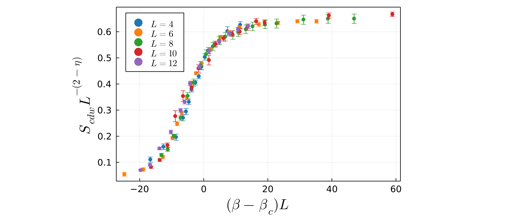

# Demo 1: One-parameter scaling

In this demo we will show how to perform finite-size scaling where one free parameter is tuned to obtain the best possible data collapse. We will use the CDW transition in the square lattice Holstein model as an example, where the critical inverse temperature $\beta_c$ is to be optimized. 

First, import the [`FiniteSizeScaling.jl`](https://owenpb.github.io/FiniteSizeScaling.jl/dev/) package:

```@repl
using FiniteSizeScaling
```

Before we can perform finite-size scaling, we need to have data for several difference lattice sizes ``L``. Suppose we have five lattice sizes ``L=4, 6, 8, 10, 12``. For each lattice size, we will have an array of ``X`` values (i.e. values of the inverse temperature ``\beta``), an array of ``Y`` values (i.e. values of the order parameter ``S_{cdw}``), and an array of ``E`` values which are the errors in each ``Y`` value. The data should be pre-arranged into arrays like this:

```@julia
X_L4 = [1.973, 2.989, 3.978, 4.513, 4.754, 4.968, 5.182, 5.476, 5.743, 5.957, 6.225, 6.492, 7.000, 7.989, 8.979]
Y_L4 = [1.250, 1.806, 2.222, 3.056, 3.333, 3.750, 4.306, 4.583, 4.861, 5.278, 5.694, 5.972, 6.250, 6.806, 7.083]
E_L4 = [0.114, 0.123, 0.132, 0.128, 0.135, 0.121, 0.130, 0.101, 0.108, 0.139, 0.133, 0.138, 0.128, 0.199, 0.137]

X_L6 = [2.000, 2.989, 4.005, 4.513, 4.754, 4.995, 5.262, 5.476, 5.743, 6.011, 6.492, 7.000, 7.455, 7.989, 9.005, 9.995, 11.010, 12.000]
Y_L6 = [1.245, 1.667, 2.778, 4.444, 5.694, 6.667, 8.056, 9.306, 10.139, 10.972, 12.222, 13.333, 13.750, 14.167, 14.444, 14.583, 14.722, 14.722]
E_L6 = [0.164, 0.153, 0.152, 0.148, 0.165, 0.151, 0.150, 0.161, 0.138, 0.169, 0.153, 0.148, 0.138, 0.149, 0.167, 0.155, 0.147, 0.160]

X_L8 = [4.487, 4.727, 4.968, 5.235, 5.503, 5.743, 6.011, 6.225, 6.492, 6.733, 6.973, 7.267, 7.481, 7.775, 8.043, 8.524, 8.979, 10.021, 10.983, 12.000]
Y_L8 = [4.861, 5.694, 7.639, 10.278, 13.472, 15.417, 17.917, 19.583, 20.694, 21.528, 22.083, 22.361, 22.778, 23.194, 23.612, 23.889, 24.028, 24.583, 24.722, 24.722]
E_L8 = [0.252, 0.289, 0.243, 0.324, 0.489, 0.524, 0.578, 0.609, 0.575, 0.589, 0.625, 0.621, 0.650, 0.623, 0.621, 0.602, 0.658, 0.665, 0.667, 0.689]

X_L10 = [4.489, 4.757, 5.000, 5.244, 5.487, 5.755, 5.971, 6.293, 6.509, 6.750, 7.018, 7.259, 7.500, 7.768, 8.035, 10.041, 12.020]
Y_L10 = [4.583, 6.111, 9.306, 15.556, 19.861, 21.806, 25.833, 27.639, 31.111, 32.361, 33.333, 33.750, 34.722, 35.972, 35.694, 37.222, 37.500]
E_L10 = [0.254, 0.289, 0.501, 1.189, 1.184, 0.790, 0.804, 1.045, 0.600, 0.584, 0.598, 0.655, 0.680, 0.640, 0.601, 0.575, 0.478]

X_L12 = [4.493, 4.734, 4.981, 5.280, 5.528, 5.637, 5.777, 6.023, 6.268, 6.539, 6.809, 7.024, 7.292]
Y_L12 = [5.432, 6.964, 11.838, 16.713, 23.120, 25.627, 31.058, 36.072, 40.669, 43.454, 45.822, 47.075, 48.050]
E_L12 = [0.321, 0.398, 0.401, 0.556, 0.531, 0.598, 0.601, 0.592, 0.625, 0.630, 0.587, 0.658, 0.688]
```

The next step is to create a single array of data, where each element is an array of ``[X, Y, E, L]`` data for a given lattice size. The length of this new array will equal the number of different lattice sizes being used:

```@julia
data_with_error = [[X_L4, Y_L4, E_L4, 4], [X_L6, Y_L6, E_L6, 6], [X_L8, Y_L8, E_L8, 8], [X_L10, Y_L10, E_L10, 10], [X_L12, Y_L12, E_L12, 12]]
```

If your ``Y`` data does not have error bars, you can also omit the arrays of error values, for example:

```@julia
data_no_error = [[X_L4, Y_L4, 4], [X_L6, Y_L6, 6], [X_L8, Y_L8, 8], [X_L10, Y_L10, 10], [X_L12, Y_L12, 12]]
```

At this point, you can call the function [`plot_data`](@ref) to display the raw unscaled data:

```@julia
julia> plot_data(data_with_error)
```


As discussed in the [Example](example_page.md) page, we aim to rescale the data along new axes ``X_s = (\beta - \beta_c) L`` and ``Y_s = S_{cdw} L^{-7/4}``. We will take $\beta_c$ to be the one free parameter we will tune to obtain the optimal data collapse, and denote it ``v_1``, i.e. our scaled axes will be ``X_s = (X - v_1) L`` and ``Y_s = Y L^{-7/4}``. For one-parameter scaling, the user now must define two functions which define the scaled X and Y axes:

```@julia
x_scaled(X, L, v1) = (X .- v1) * L
```
```@julia
y_scaled(Y, L, v1) = Y * (L^(-7/4))
```
The function defining the ``X_s`` axis should take ``X``, ``L``, and ``v_1`` as arguments, while the function defining the scaled ``Y_s`` axis should take ``Y``, ``L``, and ``v_1`` as arguments. Note that since ``X`` and ``Y`` are arrays, elementwise operators such as ``.-`` may be necessary.

To determine the best value of ``v_1``, a search is performed between an initial value ``v_{1i}`` and a final value ``v_{1f}``. For each candidate value of ``v_1``, the data is scaled according to the user-defined formulae above, and a polynomial curve of order ``p`` is fit to the data, using the method of least-squares to minimize the sum of squared residuals between the scaled data and the polynomial curve. The value of ``v_1`` which yields the smallest sum of squared residuals is identified as the optimal value. 

When performing the fit, one has the option to multiply each squared residual by a weight ``W``. For example, to perform weighted least-squares, these weights are typically inverse variances. This means that data points with larger error bars will be deemed less important for the fit, and vice-versa. To use weights when performing the fit, define an array as follows:

```@julia
fit_weights = [1 ./ (E_L4.^2), 1 ./ (E_L6.^2), 1 ./ (E_L8.^2), 1 ./ (E_L10.^2), 1 ./ (E_L12.^2)]
```
where each element is an array of ``W`` values for a given lattice size. Here inverse variances have been chosen to perform a typical weighted least-squares. Note that the length of this array will equal the number of different lattice sizes being used. Using weights is completely optional and can be omitted if desired when calling the function [`fss_one_var`](@ref).

The next step is to call the function [`fss_one_var`](@ref) to perform the finite-size scaling. 

```@julia
julia> scaled_data, residuals, min_res, best_v1 = fss_one_var(data=data_with_error, xs=x_scaled, ys=y_scaled, v1i=5.0, v1f=7.0, n1=100, p=4, weights=fit_weights);
```

where `data` is the single array of data defined previously, `xs` and `ys` are the functions previously defined for the scaled axes, `v1i` and `v1f` are the start and end points of the parameter search, and `n1` is the number of values of ``v_1`` in this range to check. The integer degree ``p`` of the polynomial must also be specified, typically $4 \leq p \leq 8$ is sufficient.  

The function [`fss_one_var`](@ref) returns four variables: an array `scaled_data_array` where each element is an array of ``[X_s, Y_s, E_s, L]`` data for a given lattice size; an array `residuals` of length `n1` which stores the sum of squared residuals for each value of ``v_1`` checked; a scalar `min_res` which is the minimum value of the array `residuals`; and a scalar `best_v1` which is the value of ``v_1`` which gave the smallest overall residual. By default it will also print out the values of `best_v1` and `min_res`:

```@julia
Optimal v1 value: 6.1313131313131315 
Smallest residual: 0.12847365603386035 
```
!!! note "Note: When $Y_s$ explicitly depends on $v_1$ set norm_y=true"

    When the scaled vertical axis ``Y_s`` has an explicit dependence on the tuned parameter ``v_1`` (and/or ``v_2`` for two-parameter scaling), the magnitude of ``Y_s`` values can vary drastically during the parameter sweep. In determining the *relative* quality of fit of a polynomial to the scaled data, the absolute magnitude of the sum of squared residuals therefore may not be an appropriate choice. 
    
    In this case, each individual fit residual should be divided by the magnitude ``Y_s`` of the corresponding data point. Then, the sum of the squares of these "normalized" residuals will provide a true measure of the relative quality of the polynomial fitting.
    
    To do this, both [`fss_one_var`](@ref) and [`fss_two_var`](@ref) take an optional boolean argument `norm_y`. Set `norm_y=true` to normalize the fit residuals. 


At this point, you can again call the function [`plot_data`](@ref), passing in the `scaled_data_array` returned by the [`fss_one_var`](@ref) function. This will produce a plot of the optimal data collapse, i.e. the scaled data with ``v_1`` set to `best_v1`:

```@julia
julia> plot_data(scaled_data)
```



After one-parameter finite-size scaling has been performed, we can plot the dependence of the sum of squared residuals on ``v_1``. To do this use the [`plot_residuals`](@ref) function, and pass in the array of residuals returned by [`fss_one_var`](@ref), along with the exact values of `v1i`, `v1f`, and `n1` which were used:

```@julia
julia> plot_residuals(residuals, v1i=5.0, v1f=7.0, n1=100)
```


!!! tip
    When using plotting functions such as [`plot_data`](@ref) or [`plot_residuals`](@ref), various plot attributes such as axes labels, font sizes, marker sizes, colors, and figure dimensions can be passed as optional arguments. See the docstrings of each plotting function or the [Methods](methods.md) page for full details. 