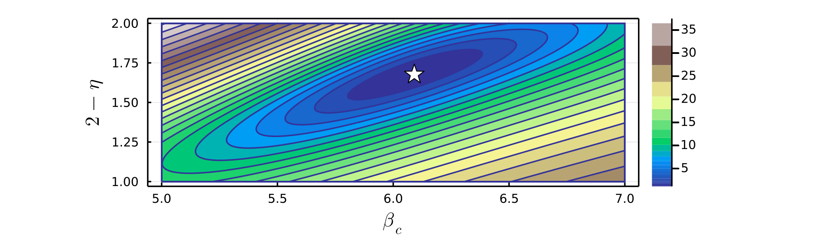

# Demo 2: Two-parameter scaling

In this demo we will show how to perform finite-size scaling where two free parameters are tuned to obtain the best possible data collapse. As in [Demo 1](demo_1.md), we will use the CDW transition in the square lattice Holstein model as an example, but this time both the critical inverse temperature ``\beta_c`` and the exponent ``2 - \eta \equiv \gamma/\nu`` are to be optimized, i.e. we do not assume the exponent is equal to its theoretical value of ``7/4`` for the Ising universality class.

Let us use the same data as in [Demo 1](demo_1.md), which as before has been loaded into an array of the form:

```@julia
data_with_error = [[X_L4, Y_L4, E_L4, 4], [X_L6, Y_L6, E_L6, 6], [X_L8, Y_L8, E_L8, 8], [X_L10, Y_L10, E_L10, 10], [X_L12, Y_L12, E_L12, 12]]
```

We now aim to rescale the data along new axes ``X_s = (\beta - \beta_c)L`` and ``Y_s = S_{cdw} L^{-(2-\eta)}``. We will take ``\beta_c`` to the first free parameter we will tune to obtain the optimal data collapse, and denote it ``v_1``, and we will take ``(2-\eta)`` to be the second free parameter, and denote it ``v_2``. That is, our scaled axes will be ``X_s = (X - v_1)L`` and ``Y_s = Y L^{-v_2}``. For two-parameter scaling, the user now must define two functions which define the scaled X and Y axes:


```@julia
x_scaled(X, L, v1, v2) = (X .- v1) * L
```
```@julia
y_scaled(Y, L, v1, v2) = Y * (L^(-1 * v2))
```

The functions defining the ``X_s`` axis should take ``X``, ``L``, ``v_1``, and ``v_2`` as arguments, while the function defining the scaled ``Y_s`` axis should take ``Y``, ``L``, ``v_1``, and ``v_2`` as arguments. Note that since ``X`` and ``Y`` are arrays, elementwise operators such as ``.-`` may be necessary.

To determine the best value of ``v_1``, a search is performed between an initial value ``v_{1i}`` and a final value ``v_{1f}``.  To determine the best value of ``v_2``, a search is performed between an initial value ``v_{2i}`` and a final value ``v_{2f}``. The finite-size scaling method works in the same way as for one-parameter scaling, except now the method finds the *pair* of ``v_1`` and ``v_2`` values which yield the minimal overall residual. As in Demo 1, we will use inverse variance weights to perform weighted least squares. 

```@julia
fit_weights = [1 ./ (E_L4.^2), 1 ./ (E_L6.^2), 1 ./ (E_L8.^2), 1 ./ (E_L10.^2), 1 ./ (E_L12.^2)]
```

However, note that since our scaled ``Y_s`` axis depends exponentially on the tuned parameter ``v_2``, it is important to "normalize" each calculated residual to obtain the best data collapse. To do this we will set `norm_y=true` when calling the two-parameter finite-size scaling function [`fss_two_var`](@ref).

!!! note "Note: When $Y_s$ explicitly depends on $v_1$ or $v_2$ set norm_y=true"

    When the scaled vertical axis ``Y_s`` has an explicit dependence on the tuned parameter ``v_1`` and/or ``v_2``, the magnitude of ``Y_s`` values can vary drastically during the parameter sweep. In determining the *relative* quality of fit of a polynomial to the scaled data, the absolute magnitude of the sum of squared residuals therefore may not be an appropriate choice. 
    
    In this case, each individual fit residual should be divided by the magnitude ``Y_s`` of the corresponding data point. Then, the sum of the squares of these "normalized" residuals will provide a true measure of the relative quality of the polynomial fitting.
    
    To do this, both [`fss_one_var`](@ref) and [`fss_two_var`](@ref) take an optional boolean argument `norm_y`. Set `norm_y=true` to normalize the fit residuals. 

The next step is to call the function [`fss_two_var`](@ref) to perform the finite-size scaling. 

```@julia
julia> scaled_data, residuals, min_res, best_v1, best_v2 = fss_two_var(data=data_with_error, xs=x_scaled, ys=y_scaled, v1i=5.0, v1f=7.0, n1=100, v2i=1.0, v2f=2.0, n2=100, p=4, weights=fit_weights, norm_y=true)
```

where `data` is the single array of data defined previously, and `xs` and `ys` are the functions previously defined for the scaled axes. Here `v1i` and `v1f` are the start and end points of the parameter search for ``v_1`` (in this example ``\beta_c``), where `n1` is the number of values of ``v_1`` in this range to check. Similarly, `v2i` and `v1f` are the start and end points of the parameter search for ``v_2`` (in this example ``(2-\eta)``), where `n2` is the number of values of ``v_2`` in this range to check.  The integer degree ``p`` of the polynomial must also be specified, typically $4 \leq p \leq 8$ is sufficient.  

The function [`fss_two_var`](@ref) returns five variables: an array `scaled_data_array` where each element is an array of ``[X_s, Y_s, E_s, L]`` data for a given lattice size; a two-dimensional array `residuals` of dimension `(n2, n1)` which stores the sum of squared residuals for each pair of ``(v_2, v_1)`` values checked; a scalar `min_res` which is the minimum value of the array `residuals`; and scalars `best_v1` and `best_v2` which are the values of ``v_1`` and ``v_2`` which gave the smallest overall residual. By default it will also print out the values of `best_v1`, `best_v2`, and `min_res`:

```@julia
Optimal v1 value: 6.090909090909091
Optimal v2 value: 1.6767676767676767
Smallest residual: 1.158515739950633 
```
At this point, you can again call the function [`plot_data`](@ref), passing in the `scaled_data` returned by the [`fss_two_var`](@ref) function. This will produce a plot of the optimal data collapse, i.e. the scaled data with ``v_1`` set to `best_v1` and ``v_2`` set to `best_v2`:

```@julia
julia> plot_data(scaled_data)
```


### Contour plot for two-parameter scaling

When performing two-parameter scaling, it is often useful to produce a contour plot showing how the quality of the data collapse varies in the ``(v_1, v_2)`` plane. To make this plot, use the function [`plot_contour`](@ref), passing in the two-dimensional array `residuals` returned by [`fss_two_var`](@ref). You will need to pass in the same values of `v1i`, `v1f`, `n1`, `v2i`, `v2f`, and `n2` which were used in [`fss_two_var`](@ref). You will also need to specify how many contour lines are drawn using the argument `levels`. `levels` can either be an integer or an array of values. If an array of values is specified, only contour lines at these specific values will be drawn on the plot. If `levels` is an integer, this sets the total number of contour lines which will be drawn. The values represented by the contour lines can either be equally spaced or logarithmically spaced, which is set by the boolean argument `logspace`. Often logarthmic spacing is best in order to get a reasonable number of contour lines plotted near the minima, and `logspace=true` by default. A solid color fill between contour lines will be drawn if the boolean argument `fill=true`, which it is by default. 

```@julia
julia> plot_contour(residuals, v1i=5.0, v1f=7.0, n1=100, v2i=1.0, v2f=2.0, n2=100, levels=30, fill=true, logspace=true, xlabel=L"\beta_c", ylabel=L"2 - \eta") 
```

The [`plot_contour`](@ref) function produces a contour plot displaying the sum of squared residuals in the ``(v_1, v_2)`` plane, where a smaller value corresponds to a better quality data collapse. The minimum residual value is also indicated by a marker on the plot, showing the location of `(best_v1, best_v2)`:


Note that various plot attributes such as the color scheme used, plot dimensions, marker size, marker color, marker shape, axes labels, and fontsizes can be customized when calling the function [`plot_contour`](@ref). For example, the `color` argument can be set to any color scheme supported by [Plots.jl](https://docs.juliaplots.org/stable/generated/colorschemes/). See the docstrings of [`plot_contour`](@ref) or the [Methods](methods.md) page for full details. Below is a contour plot showing same residuals data as above, where several of these plot attributes have been modified.

```@julia
julia> plot_contour(residuals, v1i=5.0, v1f=7.0, n1=100, v2i=1.0, v2f=2.0, n2=100, levels=25, fill=true, logspace=true, xlabel=L"\beta_c", ylabel=L"2 - \eta", color=:terrain, markersize=7, markershape=:star5, markercolor=:white, size=(800,300)) 
```




!!! tip
    To use ``\LaTeX`` when specifying axes labels, you can use a LaTeXString e.g. `L"\beta_c"`. To use the [LaTeXStrings.jl](https://github.com/stevengj/LaTeXStrings.jl) package, import it via:
    ```@julia
    julia> using LaTeXStrings
    ```